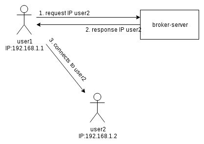

# TermTalk

## About

TermTalk is a Java Application, which allows you to communicate with your friends inside your local network.
It was written as a school-project for the IT-Module 226B.

## Usage
```
cd finish
mvn install
mvn liberty:start-server
```

## How it works


1. User1 requests the IP of user2 from the broker-server.
He delivers his IP (in this case 192.168.1.1) and asks for U2

U2 is used as key to get the IP out of the Hashmap.

2. The Broker-Server responses the IP of user2 (in this case 192.168.1.2)

3. User1 is connecting to the IP of User2 to communicate via peer-to-peer.
